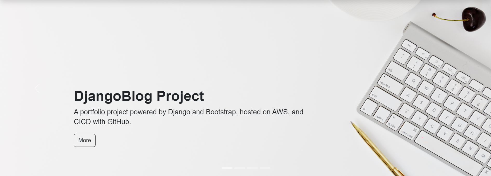

# DjangoBlog

## Introduction

`DjangoBlog` is a capstone project to learn and practice the skill of the `Django` framework. This project builds a web application where users can sign up, log in, create, display, update, and delete blogs.

---

## Tools and Tech Stack

- **IDE**: `VS Code`
- **Front End**: `HTML` + `CSS` + `Javascript` + `Bootstrap`
- **Back End**: `Django`
- **Database**(Development): Default `SQLite`
- **Version Control**: `Git` and `GitHub`

---

## GitHub Repository

| Repo                  | GitHub URL                                                   | Description           |
| --------------------- | ------------------------------------------------------------ | --------------------- |
| DjangoBlog            | https://github.com/simonangel-fong/DjangoBlog.git            | Source Code           |
| DjangoBlog-Deploy-EC2 | https://github.com/simonangel-fong/DjangoBlog-Deploy-EC2.git | Repo to deploy on EC2 |

---

## Version

- Tag Pattern

| Project alias | Release number | Proejct level / Environment configuration | App number | App version |
| ------------- | -------------- | ----------------------------------------- | ---------- | ----------- |
| blog          | 0              | 1                                         | 0          | 0           |

- Feature & Tag

| Tag            | Feature                      |
| -------------- | ---------------------------- |
| `blog-0.1.0.0` | Starting project & Home page |
| `blog-0.1.1.1` | Account                      |
| `blog-0.1.2.1` | Blog                         |
| `blog-0.2.0.0` | Environment Variable         |

---

## Documentation

| Tag          | Title                                                                             |
| ------------ | --------------------------------------------------------------------------------- |
| blog-0.1.0.0 | [Start the project and create the home page](./docs/feature_home/feature_home.md) |
| blog-0.1.1.1 | [Account feature](./docs/feature_account/feature_account.md)                      |
| blog-0.1.2.1 | [Blog feature](./docs/feature_blog/feature_blog.md)                               |
| blog-0.2.0.0 | [Enable environment variables](./docs/feature_env_var/feature_env_var.md)         |
| blog-1.0.0.0 | [Deploy checklist](./docs/feature_deploy_check/feature_deploy_check.md)           |

---

## Blog

- [Medium Blog](https://medium.com/@simonangelfong/djangoblog-project-documentation-23bb17b38796)

| Tag            | Blog Url                                                                                                                                                                    |
| -------------- | --------------------------------------------------------------------------------------------------------------------------------------------------------------------------- |
| `blog-0.1.0.0` | [DjangoBlog Project 01: Start Django Project & Home Page](https://medium.com/@simonangelfong/djangoblog-project-01-start-the-project-and-create-the-home-page-295c2d50f9d7) |
| `blog-0.1.1.1` | [DjangoBlog Project 02: Account Feature Implementation](https://medium.com/@simonangelfong/djangoblog-project-02-account-feature-e18454c8c8d6)                              |
| `blog-0.1.2.1` | [DjangoBlog Project 03: Blog Feature Implementation](https://medium.com/@simonangelfong/djangoblog-project-03-blog-feature-fc5ab7a200b2)                                    |

---

[TOP](#djangoblog)
