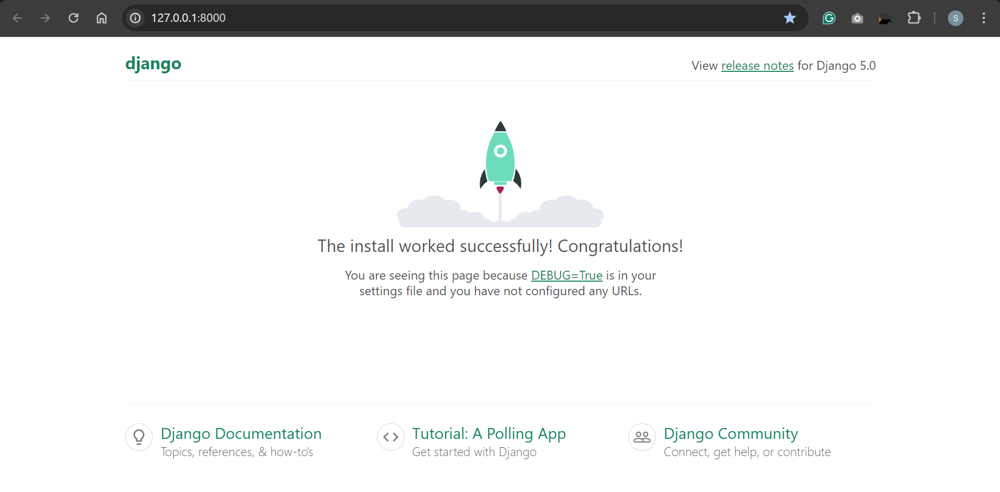
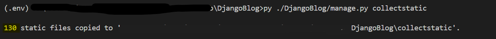

# DjangoBlog Project-01: Start the project and create the home page

[Back](../index.md)

- [DjangoBlog Project-01: Start the project and create the home page](#djangoblog-project-01-start-the-project-and-create-the-home-page)
  - [Start the Django Project](#start-the-django-project)
  - [Create Home Page](#create-home-page)
    - [Define the View:](#define-the-view)
    - [Define the URLs:](#define-the-urls)
    - [Design Home page](#design-home-page)
    - [Configure Template](#configure-template)
    - [Configure Static Files](#configure-static-files)
    - [Database Migration](#database-migration)
  - [Test Locally](#test-locally)
  - [Wrap Up](#wrap-up)

---

## Start the Django Project

- Create and activate virtual environment

```sh
# create virtual environment
py -m venv .env
```

- Install Django

```sh
# upgrade pip
python.exe -m pip install --upgrade pip
pip install django
```

- Start project: DjangoBlog

```sh
# Start project
django-admin startproject DjangoBlog
# Starts a lightweight development web server locally
py ./DjangoBlog/manage.py runserver 8000
```



- Create VSCode `launch.json` file

---

## Create Home Page

### Define the View:

Create a view `views.py` in the `DjangoBlog` for the home page that will serve as the blog landing page.

```py
from django.views.generic.base import TemplateView


# View of home page
class HomeView(TemplateView):
    template_name = "index.html"     # the template of this view
    extra_context = {'title': "ArgusWatcher Home"}    # the title of HTML
```

---

### Define the URLs:

In `urls.py`, map the home page to the `HomeView`.

```py
from django.contrib import admin
from django.urls import path
from .views import HomeView

urlpatterns = [
    path('', HomeView.as_view(), name="home"),    # Define home url
    path('admin/', admin.site.urls),     # define admin url
]
```

---

### Design Home page

`/templates/layout/base.html`: a base “skeleton” template that contains all the common elements.
`/templates/layout/nav.html`: an elements of navigation bar.
`/templates/layout/footer.html`: an elements of footer.
`/templates/index.html`: a template of home page

---

### Configure Template

Organize project-level `HTML` files in the `/templates/` directory.

```py
TEMPLATES = [
    {
        'BACKEND': 'django.template.backends.django.DjangoTemplates',
        'DIRS': [Path(BASE_DIR, 'templates'),],    # define project level template
        'APP_DIRS': True,  # By default, templates are manged at App Level
    },
# ...
]
```

---

### Configure Static Files

- Static Files:

Manage static files such as CSS, JS, and images in the `/static/` directory.

- Define CSS and JS files:

`/static/css/`: directory for css files
`/static/img/`: directory for image files

- Configuring Static Settings:

Update `/settings.py` to handle static files.

```py
# Static files (CSS, JavaScript, images)

# URL referring to static files
STATIC_URL = '/static/'
# project level static
STATICFILES_DIRS = [BASE_DIR / 'static', ]
# absolute path to the directory for deployment
STATIC_ROOT = Path(BASE_DIR, 'collectstatic')
```

- Collecting Static Files

Run the following command to collect static files for deployment.

```py
# Collects the static files into STATIC_ROOT.
py ./DjangoBlog/manage.py collectstatic
```



---

### Database Migration

At this stage, utilize `SQLite3` as the database. Execute the following commands:

```sh
py ./DjangoBlog/manage.py makemigrations    # creating new migrations based on the changes
py ./DjangoBlog/manage.py migrate    # applying migration
```


---

## Test Locally

Ensure everything is functioning by testing the blog project locally.

```sh
py ./DjangoBlog/manage.py runserver 8000
```


Access the home page and start building and viewing blog posts.

Home: http://localhost:8000/


---

## Wrap Up

- Output installed packages

Before committing the code to Git, I outputted the dependencies to the requirements.txt file.

```sh
pip freeze > requirements.txt
```

- Commit and push to repository

```sh
# Add all changes to the staging area
git add -A

# Commit the changes to the local repository with a descriptive message
git commit -m "Start the Django project and create home page"

# Create an annotated tag for version 1.0 with a message
git tag -a blog0.1.0.0 -m "Version 0.1.0.0 - Initial project, Home page feature."

# Push the commit and the tag to the remote repository
git push
```

---

[TOP](#djangoblog-project-01-start-the-project-and-create-the-home-page)
