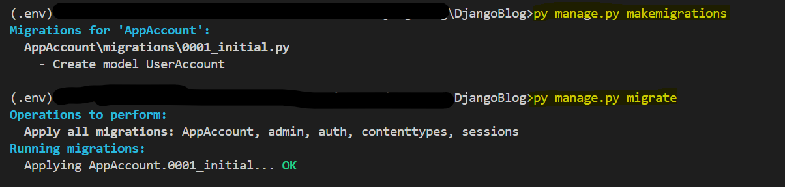
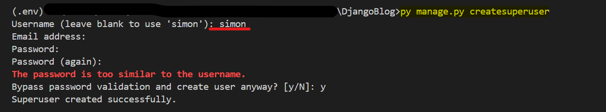
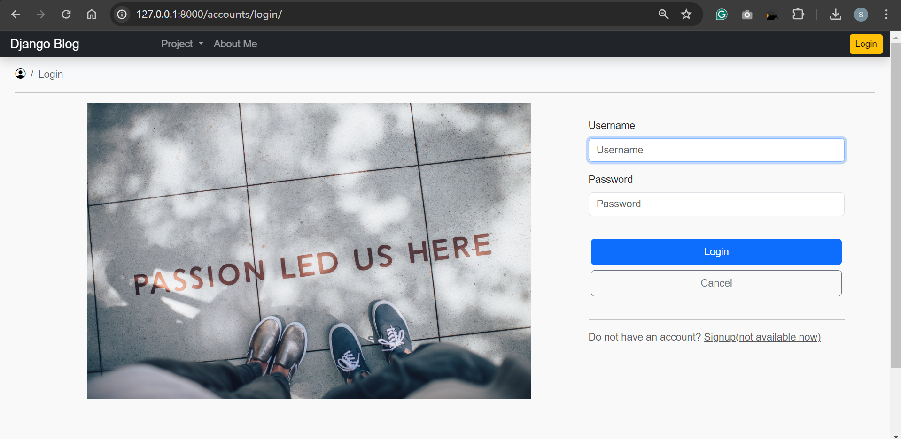
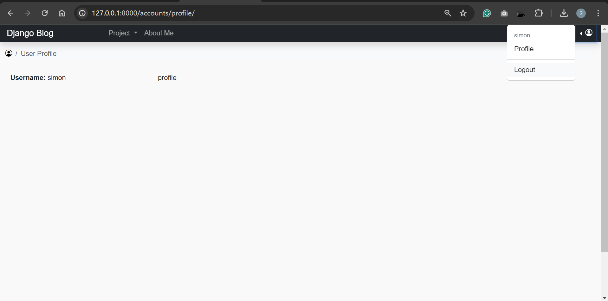
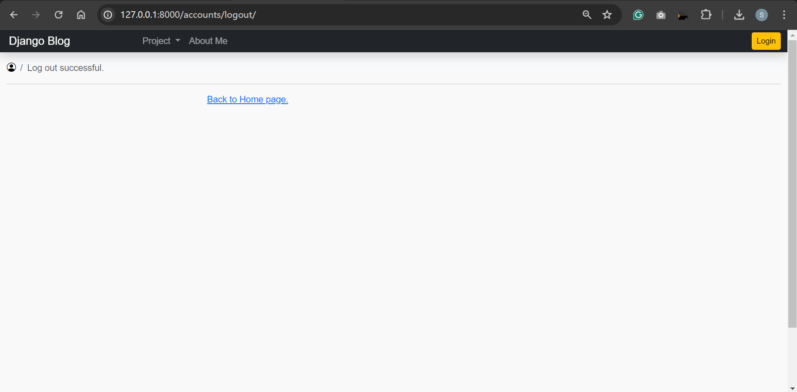

# DjangoBlog Project-02: Account feature

[Back](../index.md)

- [DjangoBlog Project-02: Account feature](#djangoblog-project-02-account-feature)
  - [Install Dependency](#install-dependency)
  - [Account Feature](#account-feature)
    - [Start the Account App](#start-the-account-app)
    - [Create Model](#create-model)
    - [Create Urls](#create-urls)
    - [Design Login and Logout Page](#design-login-and-logout-page)
  - [Add Account to Project](#add-account-to-project)
    - [Update settings.py](#update-settingspy)
    - [Update urls.py](#update-urlspy)
    - [Update NavBar Link](#update-navbar-link)
  - [Database Migration](#database-migration)
  - [Test Locally](#test-locally)
    - [Create Superuser](#create-superuser)
    - [Test](#test)
  - [Wrap Up](#wrap-up)

---

## Install Dependency

- Pip install

```sh
pip install django-bootstrap5
```

- Update **settings.py**

```py
INSTALLED_APPS = (
    # ...
    "django_bootstrap5",
    # ...
)
```

---

## Account Feature

### Start the Account App

- Start App

```sh
cd DjangoBlog
py ./manage.py startapp AppAccount
```

---

### Create Model

- Leverage Django User model

```py
from django.db import models
from django.contrib.auth import models


class UserAccount(models.User, models.PermissionsMixin):
    '''
    This class represents a user account, inheriting from the User and permission models.
    custom user class
    multiple inheritance
    User class: to represent registered users of website
    Permission Class: an abstract model that has attributes and methods to cutomize a user model
    '''

    def __str__(self):
        # self.username is a attribute of the super class User.
        return self.username

```

---

### Create Urls

```py
from django.urls import path
from django.contrib.auth.views import LoginView, LogoutView
from django.contrib.auth.decorators import login_required
from django.views.generic import TemplateView

# URL namespaces
app_name = "AppAccount"

urlpatterns = [
    # path("signup/", SignupView.as_view(), name="signup"),
    # a url for log in page, using login.html as template with a given context for render.
    path("login/", LoginView.as_view(
        template_name="AppAccount/login.html",
        extra_context={"title": "Login", "heading": "Login"}
    ), name="login"),

    # a url for log in page, using profile.html as template that is login required with a given context for render.
    path("profile/", login_required(TemplateView.as_view(
        template_name="AppAccount/profile.html",
        extra_context={"title": "User Profile", "heading": "User Profile"}
    )), name="profile"),

    # a url for log in page, using login.html as template with a given context for render.
    path("logout/", LogoutView.as_view(
        template_name="AppAccount/logout.html",
        extra_context={"title": "Log out", "heading": "Log out successful."}
    ), name="logout"),
]

```

---

### Design Login and Logout Page

**\AppAccount\templates\AppAccount\login.html**: log in page
**\AppAccount\templates\AppAccount\profile.html**: profile page
**\AppAccount\templates\AppAccount\logout.html**: log out page

---

## Add Account to Project

### Update settings.py

```py
INSTALLED_APPS = [
    # ...
    'AppAccount',
    # ...
]

```

---

### Update urls.py

```py
from django.contrib import admin
from django.urls import path, include
from .views import HomeView

urlpatterns = [
    path('', HomeView.as_view(), name="home"),
    path("accounts/", include("AppAccount.urls")),
    path('admin/', admin.site.urls),
]

```

---

### Update NavBar Link

```html
<!-- Sign in button -->

<a class="btn btn-sm btn-warning" href="">
  Login
</a>

<ul class="navbar-nav mb-2 mb-lg-0">
  <li class="nav-item dropstart">
    <a
      class="nav-link dropdown-toggle"
      href="#"
      role="button"
      data-bs-toggle="dropdown"
      aria-expanded="false"
    >
      <i class="bi bi-person-circle"></i>
    </a>
    <ul class="dropdown-menu">
      <li><h6 class="dropdown-header">{{user.username}}</h6></li>
      <!-- profile -->
      <li>
        <a class="dropdown-item" href="">
          Profile
        </a>
      </li>
      <li><hr class="dropdown-divider" /></li>
      <!-- logout -->
      <li>
        <form method="post" action="">
          
          <button class="dropdown-item" type="submit">Logout</button>
        </form>
      </li>
    </ul>
  </li>
</ul>

```

---

## Database Migration

At this stage, utilize `SQLite3` as the database. Execute the following commands:

```sh
py ./DjangoBlog/manage.py makemigrations    # creating new migrations based on the changes
py ./DjangoBlog/manage.py migrate    # applying migration
```



---

## Test Locally

### Create Superuser

```sh
py manage.py createsuperuser
```



### Test

- Login



- Profile



- Logout



---

## Wrap Up

- Output installed packages

Before committing the code to Git, I outputted the dependencies to the requirements.txt file.

```sh
pip freeze > requirements.txt
```

- Commit and push to repository

```sh
# Add all changes to the staging area
git add -A

# Commit the changes to the local repository with a descriptive message
git commit -m "Feature/Account"

# Create an annotated tag for version 1.0 with a message
git tag -a blog0.1.1.0 -m "Version 0.1.1.0 - Add Account feature"

# Push the commit and the tag to the remote repository
git push
```

---

[TOP](#djangoblog-project-02-account-feature)
