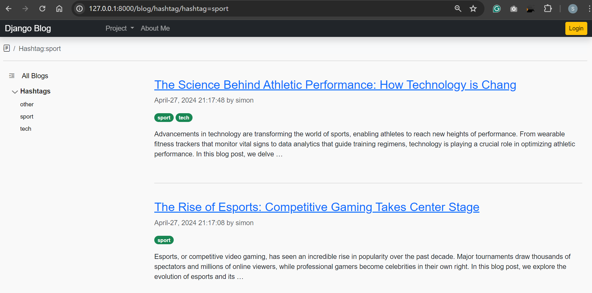

# DjangoBlog: Blog feature

[Back](../../README.md)

- [DjangoBlog: Blog feature](#djangoblog-blog-feature)
  - [Introduction](#introduction)
  - [Blog Feature](#blog-feature)
    - [Start the Blog App](#start-the-blog-app)
    - [Create Blog Model](#create-blog-model)
    - [Register Blog Model in the Admin](#register-blog-model-in-the-admin)
    - [Forms.py](#formspy)
    - [Views.py](#viewspy)
    - [URLs.py](#urlspy)
    - [Design Blog pages](#design-blog-pages)
  - [Add the Blog App To the Project](#add-the-blog-app-to-theproject)
  - [Database Migration](#database-migration)
  - [Test](#test)
    - [Create Sample Blog](#create-sample-blog)
    - [Test: Authenticated User](#test-authenticated-user)
    - [Test: Anonymous User](#test-anonymous-user)
  - [Wrap Up](#wrap-up)

---

## Introduction

In the previous development, Home page and Account features were implemented. This blog focuses on the blog feature, which enables users to draft, publish, update, and delete posts.

---

## Blog Feature

### Start the Blog App

- Start App

```sh
cd DjangoBlog
py manage.py startapp AppBlog
```

---

### Create Blog Model

- Each blog is related to an authenticated user.
- use the foreign key "auth.User" to reference the user model.

```py
from django.db import models
from django.urls import reverse
from django.utils import timezone
from django.utils.text import slugify


class Blog(models.Model):
    ''' Table of blog '''

    # author, refer to auth User, Only the registered user can post.
    author = models.ForeignKey("auth.User",
                               on_delete=models.CASCADE)
    # # the title of current post, allow only 64 characters
    title = models.CharField(max_length=64)
    # the content of current post, Can be blank or null
    content = models.TextField(blank=True, null=True)
    # created time, automatically set the field to now when the object is first created.
    created_at = models.DateTimeField(auto_now_add=True)
    # last updated time, automatically set the field to now every time the object is saved.
    updated_at = models.DateTimeField(auto_now=True)
    # the date when current post is set to be published,  It can be blan or null when the post is not set published.
    post_at = models.DateTimeField(blank=True, null=True)
    hashtags = models.ManyToManyField('Hashtag')

    # model metadata
    class Meta:
        # OrderBy created_date in descending order.
        ordering = ["-created_at"]
        # set index for post table
        indexes = [
            models.Index(fields=["author",]),
            models.Index(fields=["title",]),
            models.Index(fields=["created_at",]),
            models.Index(fields=["updated_at",]),
        ]

    def __str__(self):
        ''' str() method of current post'''
        return f'{self.title} - {self.author}'

    def get_absolute_url(self):
        ''' the url for current blog '''
        # using reverse to transform URLConf name into a url of current blog.
        # passing the pk of current blog an argument.
        return reverse("blog_detail", kwargs={"pk": self.pk})

    def post_draft(self):
        ''' post a draft into a blog '''
        if not self.post_at:
            self.post_at = timezone.now()
            self.save()


class Hashtag(models.Model):
    ''' Table of blog '''
    # name of hashtag, must be less than 32 chars and unique
    name = models.CharField(max_length=32, unique=True)
    # slug, must be unique and accepts Unicode letters
    slug = models.SlugField(unique=True, allow_unicode=True)

    def __str__(self):
        return self.name

    def save(self, *args, **kwargs):
        self.slug = slugify(self.name)
        super().save(*args, **kwargs)

    def get_absolute_url(self):
        return reverse("AppBlog:hashtag_detail", kwargs={"slug": self.slug})

    class Meta:
        ordering = ["name"]     # default ordered by name
```

---

### Register Blog Model in the Admin

```py
from django.contrib import admin
from .models import Blog, Hashtag

admin.site.register(Blog)
admin.site.register(Hashtag)
```

---

### Forms.py

- Define the form for the Blog model when creating and updating a blog.

```py
from django import forms
from .models import Blog, Hashtag


class BlogForm(forms.ModelForm):
    ''' The form to submit a post '''
    class Meta:
        model = Blog
        fields = ("title", "content", "hashtags")
        # set widgets for fields
        widgets = {
            "title": forms.TextInput(attrs={"class": "form-control"}),
            "content": forms.Textarea(attrs={"class": "form-control editor", "rows": "3"}),
            "hashtags": forms.CheckboxSelectMultiple(attrs={"class": "form-check-input"})
        }
```

---

### Views.py

```py
from django.urls import reverse_lazy
from django.contrib.auth.decorators import login_required
from django.shortcuts import render, get_object_or_404, redirect
from django.views.generic import (
    ListView, CreateView, DetailView, UpdateView, DeleteView)
from django.contrib.auth.mixins import LoginRequiredMixin

from .models import Blog, Hashtag
from .forms import BlogForm

# region public view


class DraftListView(LoginRequiredMixin, ListView):
    ''' list all drafts '''
    model = Blog
    template_name = 'AppBlog/blog_draft_list.html'
    context_object_name = 'draft_list'
    extra_context = {"heading": "Draft List",
                     "title": "Draft List"}  # context for render

    def get_queryset(self):
        # Filter drafts based on the currently logged-in user
        return Blog.objects.filter(author=self.request.user, post_at__isnull=True)

    def get_context_data(self, **kwargs):
        context = super().get_context_data(**kwargs)
        context['hashtags'] = Hashtag.objects.all()
        return context


class BlogListView(ListView):
    ''' Blog list view '''
    model = Blog
    template_name = 'AppBlog/blog_list.html'
    context_object_name = 'blog_list'
    extra_context = {"heading": "Blog List",
                     "title": "Blog List"}  # context for render

    def get_queryset(self):
        # Filter the queryset to include only blog items that have been posted
        return Blog.objects.filter(post_at__isnull=False)

    def get_context_data(self, **kwargs):
        context = super().get_context_data(**kwargs)
        context['hashtags'] = Hashtag.objects.all()
        return context


class BlogDetailView(DetailView):
    ''' Blog detail view '''
    model = Blog
    template_name = 'AppBlog/blog_detail.html'
    context_object_name = 'blog'
    extra_context = {"heading": "Detail",
                     "title": "Detail"}  # context for render

    def get_context_data(self, **kwargs):
        context = super().get_context_data(**kwargs)
        context['hashtags'] = Hashtag.objects.all()
        context['checked_tags'] = self.object.hashtags.filter(
            blog=self.object)  # return the related tags
        return context


# endregion

# region LoginRequired

class BlogCreateView(LoginRequiredMixin, CreateView):
    ''' Blog Create View '''
    model = Blog
    form_class = BlogForm       # The form class to instantiate.
    # The URL to redirect to when the form is successfully processed.
    success_url = reverse_lazy('AppBlog:draft_list')
    extra_context = {"heading": "New Blog",
                     "title": "New Blog"}  # context for render

    def get_context_data(self, **kwargs):
        context = super().get_context_data(**kwargs)
        context['hashtags'] = Hashtag.objects.all()     # load hashtags
        return context

    # When successfully validated
    def form_valid(self, form):
        self.object = form.save(commit=False)
        self.object.author = self.request.user
        form.save()
        return super(BlogCreateView, self).form_valid(form)


class BlogUpdateView(LoginRequiredMixin, UpdateView):
    ''' Blog update view '''
    model = Blog
    form_class = BlogForm
    context_object_name = 'blog'
    extra_context = {"heading": "Edit",
                     "title": "Edit"}  # context for render

    def get_success_url(self):
        # Redirect to the BlogDetailView with the updated blog's primary key
        return reverse_lazy('AppBlog:blog_detail', kwargs={'pk': self.object.pk})


class BlogDeleteView(LoginRequiredMixin, DeleteView):
    ''' Blog Delete View '''
    model = Blog
    success_url = reverse_lazy('AppBlog:blog_list')
    context_object_name = 'blog'
    extra_context = {"heading": "Blog Delete",
                     "title": "Blog Delete"}  # context for render

    def get_context_data(self, **kwargs):
        context = super().get_context_data(**kwargs)
        context['hashtags'] = Hashtag.objects.all()
        context['checked_tags'] = self.object.hashtags.filter(
            blog=self.object)  # return the related tags
        return context


@login_required
def post_blog(request, pk):
    ''' post a blog '''
    post = get_object_or_404(Blog, pk=pk)
    post.post_draft()
    return redirect('AppBlog:blog_detail', pk=pk)


def blog_by_hashtag(request, slug):
    ''' hashtag '''
    hashtag = get_object_or_404(Hashtag, slug=slug)
    print(hashtag)

    context = {
        "title": f"Hashtag:{hashtag.name}",
        "heading": f"Hashtag:{hashtag.name}",
        'hashtags': Hashtag.objects.all(),
        'hashtag': hashtag.name,
        # find blogs with hashtag
        "blog_list": Blog.objects.filter(hashtags=hashtag, post_at__isnull=False)
    }
    # print(context)
    template = "AppBlog/blog_list.html"
    return render(request, template, context)

# endregion
```

---

### URLs.py

```py
from django.urls import path
from .views import (DraftListView, BlogCreateView, BlogDetailView, BlogListView, BlogDeleteView, BlogUpdateView, post_blog,
                    blog_by_hashtag)

app_name = 'AppBlog'

urlpatterns = [
    # blog management
    path('drafts/', DraftListView.as_view(), name='draft_list'),
    path('list/', BlogListView.as_view(), name='blog_list'),
    path('new/', BlogCreateView.as_view(), name="blog_create"),
    path('detail/<int:pk>', BlogDetailView.as_view(), name="blog_detail"),
    path('edit/<int:pk>', BlogUpdateView.as_view(), name="blog_update"),
    path('delete/<int:pk>', BlogDeleteView.as_view(), name="blog_delete"),
    path('post/<int:pk>', post_blog, name="post_blog"),

    # hashtag
    path("hashtag/hashtag=<slug:slug>",
         view=blog_by_hashtag, name='blog_by_hashtag'),
]
```

---

### Design Blog pages

**AppBlog/templates/AppBlog/blog_list.html**: the page to list all published blog
**AppBlog/templates/AppBlog/blog_draft_list.html**: the page to list all unpublished blog
**AppBlog/templates/AppBlog/blog_form.html**: the page to create and update the blog
**AppBlog/templates/AppBlog/blog_detail.html**: the page to show blog detail
**AppBlog/templates/AppBlog/blog_confirm_delete.html**: the page to confirm blog deletion

---

## Add the Blog App To the Project

- settings.py

```py
INSTALLED_APPS = [
    # ...
    'AppBlog',
    # ...
]
```

- urls.py

```py
from django.contrib import admin
from django.urls import path, include
from .views import HomeView, TestView
from django.views.generic import TemplateView

urlpatterns = [
    # ...
    path('blog/', include('AppBlog.urls')),
]
```

- Update NavBar entry

```html
<!-- link: Blog -->
<li>
  <a class="dropdown-item" href="">
    Blog Project
  </a>
</li>
```

---

## Database Migration

```sh
py manage.py makemigrations
py manage.py migrate
```


---

## Test

### Create Sample Blog

- log in admin page to create new hashtag and blog for testing.


---

### Test: Authenticated User

- Blog List


- Blog Detail

The app shows an update button and a delete button for authenticated users.


- Create Draft


- Draft List


- Draft Detail


- Publish a blog


- Confirm in blog list


- Update a blog


- Delete a blog


---

### Test: Anonymous User

- The application shows only the published blog list for anonymous users.


- Blogs are filtered by different hashtags.





---

## Wrap Up

- Commit and push to the repository

```sh
# Add all changes to the staging area
git add -A

# Commit the changes to the local repository with a descriptive message
git commit -m "Feature/Blog"

# Create an annotated tag for version 1.0 with a message
git tag -a blog-0.1.2.1 -m "Version 0.1.2.1 - Add Blog and Hashtag feature"

# Push the commit and the tag to the remote repository
git push
```

---

[TOP](#djangoblog-blog-feature)
