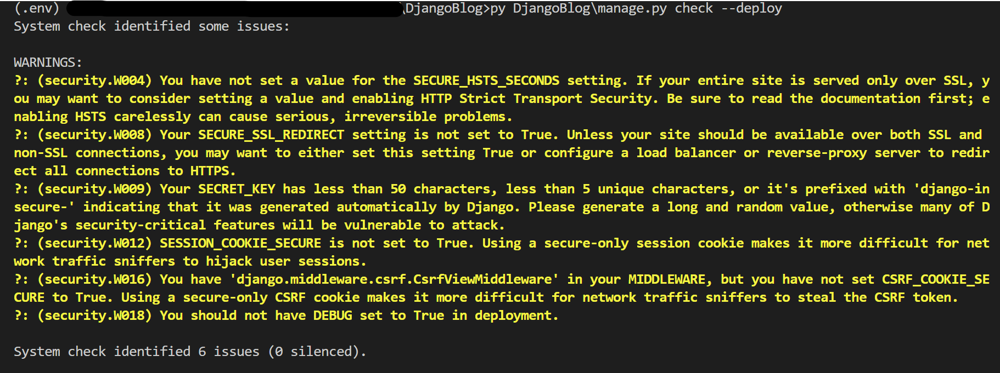
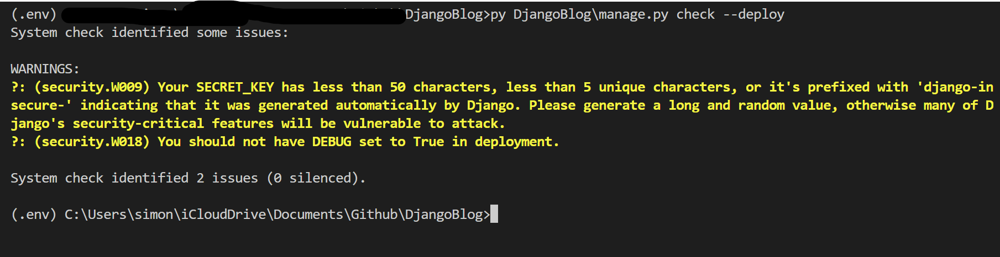

# DjangoBlog: Deploy Checklist

[Back](../../README.md)

- [DjangoBlog: Deploy Checklist](#djangoblog-deploy-checklist)
  - [Introduction](#introduction)
  - [Deployment checklist](#deployment-checklist)
  - [Environment-specific settings](#environment-specific-settings)

---

## Introduction

---

## Deployment checklist

The internet is a hostile environment. Before deploying the Django project, it is required to review the settings, with security, performance, and operations. Django includes many security features.

- Ref: https://docs.djangoproject.com/en/5.0/howto/deployment/checklist/

- Run `manage.py check --deploy` to check configuration before deploying.

```sh
python ./DjangoBlog/manage.py check --deploy
```



In this case, it reveals serveral regarding security:

| Issues                | Description                                                    | Solution                             |
| --------------------- | -------------------------------------------------------------- | ------------------------------------ |
| SECRET_KEY            | provides cryptographic signing                                 | loading from an environment variable |
| SECURE_SSL_REDIRECT   | redirects all non-HTTPS requests to HTTPS                      | set True in settings.py              |
| SESSION_COOKIE_SECURE | use a secure cookie for the session cookie                     | set True in settings.py              |
| CSRF_COOKIE_SECURE    | use a secure cookie for the CSRF cookie.                       | set True in settings.py              |
| SECURE_HSTS_SECONDS   | use the HTTP Strict Transport Security header on all responses | set non-zero value in settings.py    |

- Update settings.py

```py
# HTTPS settings
# redirects all non-HTTPS requests to HTTPS
SECURE_SSL_REDIRECT = True
# use a secure cookie for the session cookie
SESSION_COOKIE_SECURE = True
# use a secure cookie for the CSRF cookie.
CSRF_COOKIE_SECURE = True


# HSTS(HTTP Strict Transport Security) settings
# HSTS: web browsers to only interact with the website using HTTPS, ensuring secure and encrypted connections.
# sets the HTTP Strict Transport Security header on all responses that do not already have it.
SECURE_HSTS_SECONDS = 31536000  # 1 year
# the duration of one year, for whichthe browser should remember that the website should only be accessed over HTTPS.
# enforces secure connections for an extended period, helping ensure that users can't accidentally or maliciously connect to the website using HTTP.

# adds the preload directive to the HTTP Strict Transport Security header.
# tells browsers to include domain in a preloaded list of HSTS-enabled websites.
SECURE_HSTS_PRELOAD = True

# adds the includeSubDomains directive to the HTTP Strict Transport Security header.
# nstructing browsers that not only should the main domain be accessed via HTTPS, but all of its subdomains as well.
SECURE_HSTS_INCLUDE_SUBDOMAINS = True
```

- Recheck after adding configuration in the settings.py



It still reveals SECRET_KEY and DEBUG issues which are handled by the environment variables.

---

## Environment-specific settings

Apart from using the `manage.py check --deploy` to checklist issues before deploying, additional settings are required to be concerned.

- `ALLOWED_HOSTS`

When `DEBUG = False`, Django doesn’t work at all without a suitable value for `ALLOWED_HOSTS` This setting is required to protect your site against some `CSRF` attacks

In this project, it is handled by the environment variables.

- `DEBUG`

It must never enable debug in production. `DEBUG = True` enables handy features like full tracebacks in your browser. For a production environment, though, this is a really bad idea, because it **leaks lots of information** about the project: excerpts of your source code, local variables, settings, libraries used, etc

In this project, it is handled by the environment variables.

- Static files

Define `STATIC_ROOT` in the settings.py file and use `manage.py collectstatic -c --noinput` command to collects the static files into `STATIC_ROOT`.
