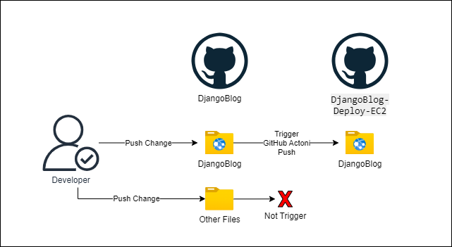
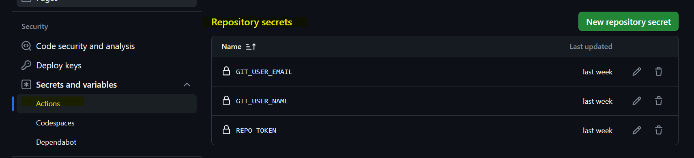
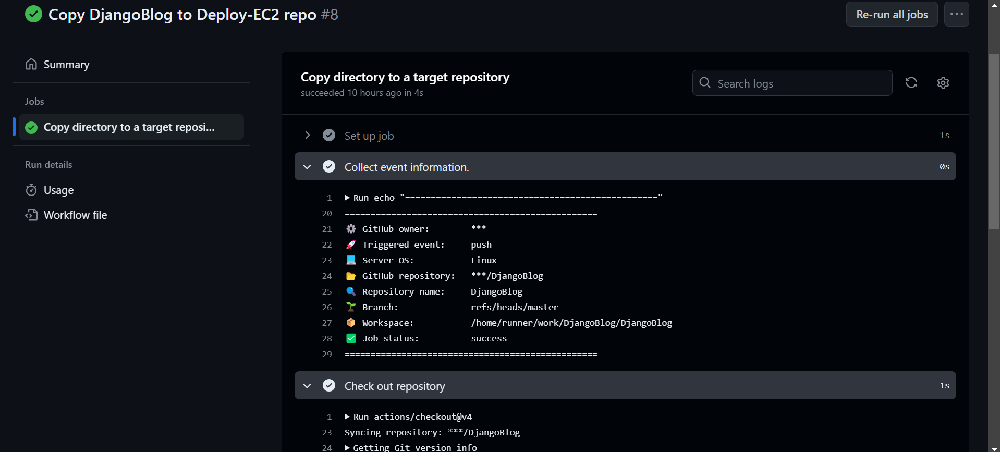
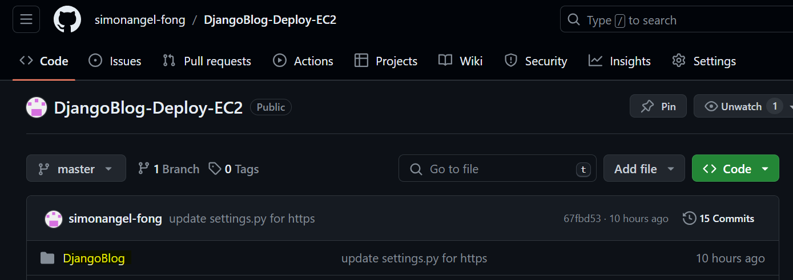

# DjangoBlog: Connect with Deploy Repo Using GitHub Action

[Back](../../README.md)

- [DjangoBlog: Connect with Deploy Repo Using GitHub Action](#djangoblog-connect-with-deploy-repo-using-github-action)
  - [Introduction](#introduction)
  - [Creating a new GitHub repository](#creating-a-new-github-repository)
  - [Define GitHub Action to Connect Repositories](#define-github-action-to-connect-repositories)
    - [Architecture](#architecture)
    - [Define Repository Secrets](#define-repository-secrets)
    - [GitHub Actions Workflow](#github-actions-workflow)
    - [Define trigger](#define-trigger)
    - [Define Environment Variables](#define-environment-variables)
    - [Define Job and Machine Type](#define-job-and-machine-type)
    - [Jobs](#jobs)
  - [Commit, Push, and Test GitHub Action Job](#commit-push-and-test-github-action-job)
  - [Appendix: GitHub Action YML file](#appendix-github-action-yml-file)

---

## Introduction

Deploying a Django project involves both the project code and additional configurations that may vary depending on the cloud services. This blog post explores the `DjangoBlog` project, which uses different GitHub repositories to practice and enhance deployment skills across various cloud services.

This document provides a step-by-step guide to creating a new GitHub repository for deployment. It also covers establishing a connection between the source code repository and the deployment repository using `GitHub Actions`.

---

## Creating a new GitHub repository

- Create a new GitHub repository to deploy the DjangoBlog project on the AWS EC2 service.

- GitHub Url: https://github.com/simonangel-fong/DjangoBlog-Deploy-EC2.git

---

## Define GitHub Action to Connect Repositories

Define the terms

- **`Source Repository`**: `DjangoBlog` is the current repository that contains the source code for the `DjangoBlog` project.
- **`Target Repository`**: `DjangoBlog-Deploy-EC2` is the repository designated for deploying the project to AWS EC2.

**GitHub Actions** will be used to automate the process of pushing changes from the **source repository** (`DjangoBlog`) to the **target repository** (`DjangoBlog-Deploy-EC2`). The subsequent sections will detail the configuration steps for this workflow.

---

### Architecture

The deployment process focuses on the Django project's code. Only changes to the `DjangoBlog` **source repository** will trigger a push to the **target repository** (`DjangoBlog-Deploy-EC2`). Therefore, any changes unrelated to the `DjangoBlog` project will not activate a push to the **target repository**.



The push operation to the **target repository** is a standard `Git` process, involving adding, committing, and pushing changes. The main steps of this operation include:

1. **Clone the Target Repository**: Begin by cloning the `DjangoBlog-Deploy-EC2` **target repository**.
2. **Remove Existing Directory**: Delete the existing directory in the **target repository** to make space for the new content.
3. **Copy Source Directory**: Copy the desired directory from the **source repository** to the **target repository**.
4. **Add and Commit Changes**: Add and commit the copied changes to the **target repository**.
5. **Push Change**s: Push the newly committed changes to the **target repository**.
6. **Clean Up**: Complete the process by cleaning up temporary directories and files.

---

### Define Repository Secrets

To execute the workflow job securely, three repository secrets need to be defined:

- `GIT_USER_EMAIL`: The email associated with the **target repository**.
- `GIT_USER_NAME`: The username associated with the **target repository**.
- `REPO_TOKEN`: The personal access token for the **target repository**, granting necessary permissions for Git operations.

These secrets are essential for authenticating and authorizing the `GitHub Actions` workflow to perform tasks such as cloning, committing, and pushing changes to the target repository. Ensure these values are set correctly in the repository's settings.



---

### GitHub Actions Workflow

To create a `GitHub Actions` workflow, the following steps must be taken:

- Create a `.github\workflows\` directory in the repository.
- Define a `.yml` file within the directory to outline `the GitHub Actions` jobs.

---

### Define trigger

To specify the events that initiate the workflow, use the `on` key in the YAML configuration.

As the focus is on changes to the `DjangoBlog` directory, define a trigger that monitors this directory using the paths command:

```yml
# the trigger for this workflow
on:
  push:
    paths:
      # Triggered only by a custom directory
      - "DjangoBlog/**"
```

---

### Define Environment Variables

To configure the action jobs, define the environment variables for use in the workflow:

```yml
# variables that are available to the steps of all jobs in the workflow.
# define values here
env:
  REMOTE_URL: https://github.com/simonangel-fong/DjangoBlog-Deploy-EC2.git # custom remote url
  REMOTE_REPO: DjangoBlog-Deploy-EC2
  SOURCE_REPO: ${{ github.event.repository.name }}
  COMMIT_MESSAGE: ${{ github.event.head_commit.message }}
  TEMP_DIR: temp_dir
  TARGET_DIR: DjangoBlog # custom the target dir
```

- `REMOTE_URL`: The URL of the **target repository** (`DjangoBlog-Deploy-EC2`).
- `REMOTE_REPO`: The name of the **target repository**.
- `SOURCE_REPO`: The name of the **source repository**, retrieved from the `GitHub Events API`.
- `COMMIT_MESSAGE`: The commit message of the most recent commit, retrieved from the `GitHub Events API`.
- `TEMP_DIR`: The name of the temporary directory used for processing `GitHub Actions` jobs.
- `TARGET_DIR`: The name of the directory in the **target repository** where updated code will be stored.

These environment variables provide necessary information and context for the workflow jobs, ensuring that they operate correctly and efficiently.

---

### Define Job and Machine Type

To specify the job and its runtime environment, use the following configuration:

```yml
# Define the jobs that run within this workflow
jobs:
  # Define a unique job name
  Copy-directory-to-target:
    # Assign a descriptive name for the job
    name: Copy directory to a target repository

    # Specify the type of machine to execute the job
    runs-on: ubuntu-latest # Use the latest Ubuntu version for the job runtime
```

The job named `Copy-directory-to-target` will execute on the latest version of `Ubuntu`. This configuration groups the tasks that will run within the job, providing a clear and organized structure for the workflow.

---

### Jobs

- Collect Current Event Information

The following job step collects information about the current event, such as the triggered event, repository name, and other relevant details:

```yml
steps:
  # Task: Collect event information.
  - name: Collect event information.
    run: |
      echo "================================================="
      echo "⚙️ GitHub owner:        ${{ github.actor }}" 
      echo "🚀 Triggered event:     ${{ github.event_name }}" 
      echo "💻 Server OS:           ${{ runner.os }}"
      echo "📂 GitHub repository:   ${{ github.repository }}"
      echo "🔍 Repository name:     ${{ github.event.repository.name }}"
      echo "🌱 Branch:              ${{ github.ref }}"
      echo "📦 Workspace:           ${{ github.workspace }}"
      echo "✅ Job status:          ${{ job.status }}"
      echo "================================================="
```

---

- Check Out Repository

Checks out a copy of the repository under $GITHUB_WORKSPACE so it can be accessed and used for further steps:

```yml
# Task: checks out a copy of repository.
- name: Check out repository
  uses: actions/checkout@v4
```

- Clone the Target Repository

Clones the **target repository** to a temporary directory for further processing. It uses the `working-directory` parameter to specify the working directory for the shell during this step.

```yml
# Task: Clone the target repo
- name: Clone the target repo
  run: |
    mkdir $TEMP_DIR
    git clone $REMOTE_URL $TEMP_DIR
  working-directory: /home/runner/work/${{env.SOURCE_REPO}}/
```

- Remove the Existing Directory

Removes the existing directory in the target repository. This prepares the target repository for the new content.

```yml
# Task: Remove the existing directory in the target repository
- name: Remove the existing directory in the target repository
  run: |
    rm -rf ./$TEMP_DIR/$TARGET_DIR
  working-directory: /home/runner/work/${{env.SOURCE_REPO}}/
```

- Copy the Directory from the **Source Repository** to the **Target Repository**

```yml
# Task: Copy the directory to the target repository
- name: Copy the directory to the target repository
  run: |
    cp -r ./$SOURCE_REPO/$TARGET_DIR ./$TEMP_DIR/$TARGET_DIR
  working-directory: /home/runner/work/${{env.SOURCE_REPO}}/
```

- Configure Git User for Committing Changes

To push the processed code to the **target repository**, the Git user email and username need to be configured:

```yml
# Task: Configure Git user for committing changes
- name: Configure Git user
  run: |
    git config --global user.email "${{secrets.GIT_USER_EMAIL}}"
    git config --global user.name "${{secrets.GIT_USER_NAME}}"
  working-directory: /home/runner/work/${{env.SOURCE_REPO}}/${{env.TEMP_DIR}}/
```

- Add and Commit the Changes

```yml
# Task: Commit the changes
- name: Commit changes
  run: |
    git add -A
    git commit -m "$COMMIT_MESSAGE"
    git log --oneline -4
  working-directory: /home/runner/work/${{env.SOURCE_REPO}}/${{env.TEMP_DIR}}/
```

- Push the New Commit to the **Target Repository**

```yml
# Task: Push the changes
- name: Push changes
  run: |
    git remote set-url origin $REMOTE_URL
    git push https://${{secrets.REPO_TOKEN}}@github.com/${{secrets.GIT_USER_NAME}}/${{env.REMOTE_REPO}}.git
  working-directory: /home/runner/work/${{env.SOURCE_REPO}}/${{env.TEMP_DIR}}/
```

- Clean Up Temporary Directory

```yml
# Task: Remove temp dir
- name: Remove temp dir
  run: |
    rm -rf ${{env.TEMP_DIR}}/
    pwd
    ls
  working-directory: /home/runner/work/${{env.SOURCE_REPO}}/
```

---

## Commit, Push, and Test GitHub Action Job

After making changes to the **source repository**, changes irrelevant to the DjangoBlog project will not trigger the `GitHub Action job`. However, any modifications within the `DjangoBlog` directory will activate the job, as it monitors changes in this specific area.



After a successful push, check the **target repository** to confirm that the latest code has been pushed.



This process establishes a connection between the **source code repository** and the **target deployment repository**, laying the groundwork for the later deployment checklist steps. These steps will be discussed in a future document.

---

## Appendix: GitHub Action YML file

```yml
# The name of the workflow. It will appear in the "Actions" tab
name: Copy DjangoBlog to Deploy-EC2 repo
# The name for workflow runs generated from the workflow.
run-name: Copy DjangoBlog to Deploy-EC2 repo

# the trigger for this workflow
on:
  push:
    paths:
      # Triggered only by a custom directory
      - "DjangoBlog/**"

# variables that are available to the steps of all jobs in the workflow.
# define values here
env:
  REMOTE_URL: https://github.com/simonangel-fong/DjangoBlog-Deploy-EC2.git # custom remote url
  REMOTE_REPO: DjangoBlog-Deploy-EC2
  SOURCE_REPO: ${{ github.event.repository.name }}
  COMMIT_MESSAGE: ${{ github.event.head_commit.message }}
  TEMP_DIR: temp_dir
  TARGET_DIR: DjangoBlog # custom the target dir

# Groups together all the jobs that run in this workflow.
jobs:
  # Defines a job name.
  Copy-directory-to-target:
    # set a name for the job
    name: Copy directory to a target repository
    # define the type of machine to run the job on.
    runs-on: ubuntu-latest
    # a sequence of tasks in a job
    steps:
      # Task: Collect event information.
      - name: Collect event information.
        run: |
          echo "================================================="
          echo "⚙️ GitHub owner:        ${{ github.actor }}" 
          echo "🚀 Triggered event:     ${{ github.event_name }}" 
          echo "💻 Server OS:           ${{ runner.os }}"
          echo "📂 GitHub repository:   ${{ github.repository }}"
          echo "🔍 Repository name:     ${{ github.event.repository.name }}"
          echo "🌱 Branch:              ${{ github.ref }}"
          echo "📦 Workspace:           ${{ github.workspace }}"
          echo "✅ Job status:          ${{ job.status }}"
          echo "================================================="

      # Task: checks out a copy of repository.
      - name: Check out repository
        uses: actions/checkout@v4

      # Task: Clone the target repo
      - name: Clone the target repo
        run: |
          mkdir $TEMP_DIR
          git clone $REMOTE_URL $TEMP_DIR
        working-directory: /home/runner/work/${{env.SOURCE_REPO}}/

      # Task: Remove the existing directory in the target repository
      - name: Remove the existing directory in the target repository
        run: |
          rm -rf ./$TEMP_DIR/$TARGET_DIR
        working-directory: /home/runner/work/${{env.SOURCE_REPO}}/

      # Task: Copy the directory to the target repository
      - name: Copy the directory to the target repository
        run: |
          cp -r ./$SOURCE_REPO/$TARGET_DIR ./$TEMP_DIR/$TARGET_DIR
        working-directory: /home/runner/work/${{env.SOURCE_REPO}}/

      # Task: Configure Git user for committing changes
      - name: Configure Git user
        run: |
          git config --global user.email "${{secrets.GIT_USER_EMAIL}}"
          git config --global user.name "${{secrets.GIT_USER_NAME}}"
        working-directory: /home/runner/work/${{env.SOURCE_REPO}}/${{env.TEMP_DIR}}/

      # Task: Commit the changes
      - name: Commit changes
        run: |
          git add -A
          git commit -m "$COMMIT_MESSAGE"
          git log --oneline -4
        working-directory: /home/runner/work/${{env.SOURCE_REPO}}/${{env.TEMP_DIR}}/

      # Task: Push the changes
      - name: Push changes
        run: |
          git remote set-url origin $REMOTE_URL
          git push https://${{secrets.REPO_TOKEN}}@github.com/${{secrets.GIT_USER_NAME}}/${{env.REMOTE_REPO}}.git
        working-directory: /home/runner/work/${{env.SOURCE_REPO}}/${{env.TEMP_DIR}}/

      # Task: Remove temp dir
      - name: Remove temp dir
        run: |
          rm -rf ${{env.TEMP_DIR}}/
          pwd
          ls
        working-directory: /home/runner/work/${{env.SOURCE_REPO}}/
```

---

[TOP](#djangoblog-connect-with-deploy-repo-using-github-action)
